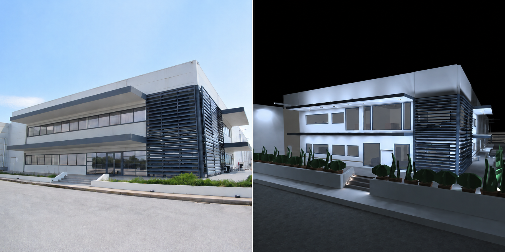

# Industrial Facility Lighting Design

### Diploma Thesis – Electrical & Computer Engineering

Lighting design and photometric analysis of a real industrial production facility using **DIALux evo** and **AutoCAD**, with evaluation based on the requirements of **EN 12464-1** and **EN 12464-2**.

---

## 📌 Project Overview

This diploma thesis focuses on the complete lighting design of an industrial production facility, covering both **indoor and outdoor areas**.

<p align="center">
  
</p>

<p align="center">
  <em>Real industrial facility and corresponding lighting design visualization developed in DIALux evo.</em>
</p>

The project includes the development of a detailed 3D lighting model, luminaire selection and placement, photometric calculations, lighting quality evaluation and comparison between the existing and proposed lighting installations.

The main objective was to design a lighting system that satisfies the required illumination levels while also considering:

- Maintained illuminance
- Lighting uniformity
- Glare limitation
- Appropriate luminaire selection
- Environmental conditions
- Energy consumption
- Industrial operating requirements

---

## 🏭 Areas Included in the Study

The lighting study covers a wide range of industrial and auxiliary areas, including:

### Indoor Areas

- Production halls
- High-rack warehouse
- Storage areas
- Corridors
- Offices
- Laboratory
- Meeting room
- Canteen
- WC areas
- Cold-storage and freezer areas
- Loading areas

### Outdoor Areas

- Industrial road network
- Building perimeter
- Loading and unloading zones
- Parking areas
- Main entrance and security gate
- Building façades
- Exterior access points and ramps

---

## 🛠️ Software & Engineering Tools

| Tool | Application |
|---|---|
| **DIALux evo** | 3D lighting modelling, luminaire placement and photometric calculations |
| **AutoCAD** | Architectural drawings and facility layout preparation |
| **Microsoft Excel** | Results organization and comparison |
| **Technical Standards** | Definition and verification of lighting requirements |

---

## 📐 Lighting Standards

The lighting design was evaluated according to:

- **EN 12464-1** – Light and lighting – Lighting of work places – Indoor work places
- **EN 12464-2** – Light and lighting – Lighting of work places – Outdoor work places

The main evaluated parameters include:

| Parameter | Description |
|---|---|
| **Eₘ / Eavg** | Maintained / average illuminance |
| **Emin** | Minimum illuminance |
| **U₀** | Lighting uniformity |
| **UGR** | Unified Glare Rating |
| **Power** | Installed lighting power |
| **Energy Performance** | Comparison of lighting solutions |

---

## 💡 Lighting Design Requirements

The lighting system was designed with emphasis on industrial operating conditions.

Important design considerations included:

- High luminous-flux industrial luminaires
- Low-glare lighting solutions
- Appropriate protection ratings for demanding environments
- Lighting suitable for cold-storage areas
- Indoor and outdoor industrial lighting
- Uniform illumination of working surfaces
- Reduction of glare in work areas
- Energy-efficient luminaire selection

---

## 🔄 Existing vs Proposed Lighting Design

Two separate DIALux models were developed:

### Existing Installation

The existing lighting installation was reconstructed and evaluated in order to determine its photometric performance.

### Proposed Installation

A new lighting system was designed with improved luminaire placement and lighting performance according to the requirements of the corresponding work areas.

This allowed a direct comparison of:

- Illuminance levels
- Uniformity
- Glare
- Luminaire distribution
- Installed power
- Energy performance

---

## 🖥️ DIALux 3D Model

The complete industrial facility was recreated in **DIALux evo**, including building geometry, working areas, calculation surfaces, industrial equipment zones and exterior areas.

<!-- Add screenshot here -->

```text
images/dialux-overview.png
